# RetinoScope: An Interpretable Radiomics-Based Multimodal Framework for Retinal Disease Classification — Final Year Project (FYP-I + FYP-II) Report

**Authors:** *RetinoScope Project Team*
**Project scope:** Complete Final Year Project — covers FYP-I (data acquisition, radiomics feature extraction, ensemble feature selection, per-modality XGBoost, late fusion baseline) and FYP-II (attention mid-level fusion, multi-seed robustness, SHAP/XAI interpretability, hybrid ablation, clinical-decision dashboard)
**Repository root:** [`./`](./)
**Date prepared:** 2026-04-26

---

## Abstract

We present **RetinoScope**, a radiomics-based multimodal framework for classifying retinal pathologies from paired Fundus photography and Optical Coherence Tomography (OCT) imagery. The project spans two phases:

- **FYP-I** built the data pipeline (multimodal acquisition, 139-feature radiomics extraction per modality, ensemble feature selection from 139 → 50, per-modality XGBoost classifiers, and grid-searched decision-level Late Fusion at ~88.3 % baseline accuracy).
- **FYP-II** added a **Deep Learning Mid-Level Fusion network** with a learned soft attention gate over the concatenated 278-D radiomics vector, an imbalance-aware training recipe (focal loss + inverse-frequency sampler + sqrt class weights + StandardScaler), a 5-seed robustness study, a SHAP-based interpretability layer, a hybrid Attention→XGBoost ablation, per-class attention diagnostics, and a clinical-decision dashboard integrating both pipelines.

Across seven classification approaches (single-modality Fundus, single-modality OCT, three late-fusion rules, attention mid-fusion, and a hybrid Attention→XGBoost), the ML geometric-mean late fusion attains the best raw accuracy (88.92 %) while the DL attention-fusion model attains the best **balanced accuracy** (80.65 %). A 5-seed robustness analysis shows the DL pipeline is stable (macro-F1 = 0.7242 ± 0.017) and matches the ML baseline on macro-F1 while delivering a ~5-point gain in balanced accuracy and a rare-class mean recall of 0.78 ± 0.01. SHAP-based interpretability confirms OCT contributes 53–63 % of the prediction signal across classes; the attention gate independently corroborates this with a mean OCT gate of 0.59 ± 0.03. We discuss the surprising finding that a hybrid Attention→XGBoost path fails to improve over the pure DL pipeline on minority-class metrics, and we explicitly quantify the synthetic class-based pairing limitation that affects all paired-evaluation numbers.

---

## 1 Introduction

### 1.1 Motivation

Retinal imaging is central to the diagnosis of vision-threatening conditions including diabetic retinopathy, age-related macular degeneration (AMD) and glaucoma. **Fundus photography** captures the surface of the retina and is well suited to vascular and pigmentary lesions; **Optical Coherence Tomography (OCT)** produces depth-resolved cross-sections of the retinal layers and is well suited to thickness-based and structural pathologies. Fundus and OCT therefore carry **complementary diagnostic signals**.

Although deep convolutional neural networks (CNNs) achieve state-of-the-art accuracy on either modality individually, two practical concerns motivate this project:

1. **Interpretability.** End-to-end CNNs produce high-dimensional latent features that are difficult for clinicians to inspect. Radiomics features — quantitative texture, shape, and frequency descriptors with explicit mathematical definitions — are inherently more transparent and align with how radiologists already reason about images.
2. **Multimodal integration.** Late fusion of probabilities is the simplest cross-modality strategy but cannot capture sub-symbolic interactions between Fundus textures and OCT structural anomalies. Mid-level fusion with learned per-feature gating provides the same transparency advantage as radiomics while still allowing interaction modelling.

### 1.2 Contributions across the full project

This report covers the entire two-phase project. Contributions are grouped by phase so the reader can see the logical progression:

#### FYP-I contributions (data → ML baseline)

- **F1.** **Multimodal data acquisition and preprocessing** ([data_loader.py](data_loader.py)) including multi-encoding image loading, train/dev/test splits, and class-distribution profiling.
- **F2.** **Hybrid radiomics feature extraction** for both Fundus and OCT modalities, producing 139 quantitative features per image ([feature_extractor_alternative.py](feature_extractor_alternative.py), [radiomics_extractor.py](radiomics_extractor.py)) covering first-order statistics, GLCM/GLRLM textures, Local Binary Patterns, Gabor responses, and FFT band energies.
- **F3.** **Square-root inverse-frequency class weighting** as a stable remedy for the dataset's 380:1 class imbalance — used at both training time (loss reweighting) and (later) in the DL pipeline.
- **F4.** **Robust ensemble feature selection** ([feature_selector.py](feature_selector.py)) that combines ANOVA F-test, Mutual Information, and Random-Forest importance via majority voting to reduce 139 → 50 features per modality.
- **F5.** **Dual-stream XGBoost classifiers** trained independently per modality ([fundus_pipeline.py](fundus_pipeline.py), [oct_pipeline.py](oct_pipeline.py), [model_trainer.py](model_trainer.py)), each saved with its fitted feature selector for downstream reuse.
- **F6.** **Decision-level Late Fusion** ([latefusion.py](latefusion.py)) with grid-searched modality weights, achieving the FYP-I baseline test accuracy of ~88.3 % (extended in this report to also benchmark geometric and max-rule fusion variants — § 6.1).

#### FYP-II contributions (DL fusion + interpretability + ablations)

- **F7.** **Attention-based Mid-Level Fusion network** ([retina_attention_fusion.py](retina_attention_fusion.py)) that consumes a 278-dimensional concatenated Fundus + OCT radiomics vector, learns a sigmoid gate per feature, and classifies seven retinal categories.
- **F8.** **Imbalance-aware DL training recipe**: focal loss with γ = 2 layered on top of the FYP-I sqrt class weights, plus a `WeightedRandomSampler` for inverse-frequency oversampling, plus per-feature `StandardScaler` and `ReduceLROnPlateau` scheduling with early stopping.
- **F9.** **Head-to-head benchmark of seven approaches** (single-modality, three late-fusion rules, mid-level attention fusion, hybrid Attention→XGBoost) on identical class-paired test data ([benchmark_all.py](benchmark_all.py)).
- **F10.** **5-seed robustness study** with mean ± std reporting and a per-class F1 stability analysis ([retina_attention_fusion.py](retina_attention_fusion.py) `--seeds`, [plot_multiseed_summary.py](plot_multiseed_summary.py)).
- **F11.** **SHAP interpretability** for both XGBoost models (TreeExplainer) and the attention DL network (GradientExplainer), with per-class top-feature ranking and per-class modality-contribution analysis ([shap_analysis.py](shap_analysis.py)).
- **F12.** **Per-class attention diagnostics** that substantiate the gate's modality preference at class-level granularity ([fusion_attention_test_per_class.png](fusion_attention_test_per_class.png)).
- **F13.** **Hybrid Attention → XGBoost ablation** isolating whether the gate alone is responsible for the DL pipeline's gains.
- **F14.** **Clinical-decision-support Streamlit dashboard** ([streamlit_app.py](streamlit_app.py)) that loads both ML and DL pipelines, accepts uploaded Fundus + OCT pairs, and displays predictions, probabilities, the per-feature attention strip, and an inter-method agreement indicator.

### 1.3 Project timeline (FYP-I → FYP-II)

| Phase | Window | Milestones | Status |
|---|---|---|---|
| 1 | Proposal → Mid FYP-I | Problem identification, literature review, dataset selection | Done (FYP-I) |
| 2 | Mid FYP-I → Final FYP-I | Custom radiomics extraction, ensemble feature selection, per-modality XGBoost, decision-level Late Fusion (88.3 % baseline) | Done (FYP-I) |
| 3 | Final FYP-I → Mid FYP-II | Attention Mid-Level Fusion architecture, focal-loss + sampler imbalance recipe, integrated `StandardScaler` (current report) | Done (FYP-II Mid) |
| 4 | Mid FYP-II → Completion | SHAP/XAI integration, ablation study (hybrid Attention→XGBoost), multi-seed robustness, per-class attention diagnostics, dashboard with DL fusion (current report) | Done (FYP-II Mid) |
| 5 | Completion → Submission | Patient-level paired evaluation, Class-1 remediation, journal-style write-up, optional CNN baseline | Future work (§ 8.2) |

---

## 2 Background and Concepts

This section explains every key concept used in the project so a reader who is not specialised in radiomics, attention mechanisms, or imbalanced-class learning can follow the rest of the report.

### 2.1 Radiomics

**Radiomics** is the extraction of large numbers of quantitative descriptors ("biomarkers") from medical images. Each feature is a deterministic function of pixel intensities and therefore carries a precise mathematical meaning. The 139 features used in this project per modality cover four families:

- **First-order statistics** (mean, variance, skewness, kurtosis, percentiles) — capture global intensity distribution.
- **Texture features** (Gray-Level Co-occurrence Matrix [GLCM], Gray-Level Run-Length Matrix [GLRLM], Local Binary Patterns [LBP]) — capture spatial regularity and roughness, which differ between healthy retina and lesion tissue.
- **Filter-bank responses** (Gabor filters at multiple orientations and scales) — capture oriented frequency content, sensitive to vessel density and OCT layer striations.
- **Frequency-domain descriptors** (FFT-derived band energies) — capture global periodic structure.

Because every feature is interpretable on its own, downstream models built on radiomics inherit a baseline level of explainability that pixel-CNN features do not provide.

### 2.2 The two modalities

| Property | Fundus | OCT |
|---|---|---|
| Type | 2-D RGB photograph | 2-D grayscale cross-section (B-scan) |
| Spatial information | Surface (retinal nerve fibre layer, vessels, optic disc) | Depth-resolved (10 retinal layers + RPE + choroid) |
| Strong for | Diabetic retinopathy, hypertensive retinopathy, vascular lesions | AMD, glaucoma, macular oedema, central serous retinopathy |
| Acquisition cost | Lower | Higher |
| Output of pipeline | 139 radiomics features per image | 139 radiomics features per image |

The two modalities answer different diagnostic questions, which motivates fusion rather than choosing one modality.

### 2.3 Class imbalance and sqrt frequency weighting

The dataset is severely imbalanced: in the held-out paired test set Normal has 5708 samples while the rarest class has only 15 samples (a **380:1** majority-to-minority ratio). Two standard remedies are combined in the DL pipeline:

- **Square-root inverse-frequency weighting**: class weight `w_c = 1 / sqrt(n_c)`, normalised so the mean weight equals 1. This is a softer reweighting than `1/n_c`, which over-amplifies tiny classes and destabilises gradients.
- **WeightedRandomSampler**: every epoch resamples the training pool so each class appears with roughly equal probability. The model sees minority classes far more often than they would naturally appear.

These two corrections are *complementary*: the first changes the loss scale, the second changes the data the model sees.

### 2.4 Focal loss

Focal loss (Lin et al., 2017) modifies cross-entropy by down-weighting examples the model is already confident about:

```
FL(p_t) = α · (1 − p_t)^γ · CE(p_t)
```

where `p_t` is the predicted probability of the true class and `γ ≥ 0` is the focusing exponent (we use γ = 2). When `p_t` is close to 1 (easy correct example), `(1 − p_t)^γ` is near zero and contributes little; when `p_t` is small (hard / misclassified) the loss is unattenuated. Combined with the sqrt class weights this yields a loss function that is sensitive to (a) which class an example belongs to and (b) how hard the example currently is — both effects favour the under-represented and difficult minority classes.

### 2.5 Late fusion

**Late (decision-level) fusion** trains an independent model per modality and combines their probability outputs at inference time. Four rules are evaluated in this report:

| Rule | Formula | Intuition |
|---|---|---|
| Weighted average | `w_F · p_F + w_O · p_O` | Linear combination, weights tuned by grid search |
| Plain average | `(p_F + p_O) / 2` | Equal-weight ensemble baseline |
| Geometric mean | `√(p_F · p_O)`, renormalised | Emphasises agreement; both modalities must support a class |
| Maximum | `max(p_F, p_O)`, renormalised | Optimistic — accepts the more confident modality |

Late fusion is simple, training-cost free at the fusion level, and inherits the per-modality model's interpretability. Its limitation is that it only sees the final probability vector — any cross-modality interaction lower in the feature hierarchy is invisible to it.

### 2.6 Mid-level fusion with soft attention gating

Mid-level fusion concatenates the two modalities' radiomics vectors into a single 278-dimensional input and trains a joint model on top. The architecture used here is:

```
x ∈ R^278  (139-D Fundus ‖ 139-D OCT)
   ↓
attention sub-network: a = sigmoid(W₂ · ReLU(W₁ · x + b₁) + b₂)   ∈ (0,1)^278
   ↓
gated input: x' = a ⊙ x   (element-wise product — "soft mask")
   ↓
classifier MLP: 278 → 128 → 32 → 7   with dropout 0.35
   ↓
softmax over 7 classes
```

The attention vector `a` has the same dimensionality as `x`. Each component `a_i ∈ (0, 1)` is a learned, **sample-dependent** scalar that down-weights uninformative or noisy features and amplifies informative ones. Because the gate is per-sample, the model can route different sub-spaces of features for different inputs — this is what allows it to specialise on rare classes while still using majority-class signal effectively. This mechanism replaces the explicit RFE feature selection of the ML pipeline with a learned, continuous, end-to-end equivalent.

### 2.7 Evaluation metrics — what each one measures

| Metric | Definition | When to prefer it |
|---|---|---|
| **Accuracy** | (TP + TN) / N over all classes | Class distribution is balanced or majority-class performance is the goal |
| **Balanced accuracy** | Mean of per-class recall | Class distribution is imbalanced and each class matters equally — primary metric in this report |
| **Macro-F1** | Mean of per-class F1 | Sensitive to both precision and recall on every class; standard for multiclass imbalanced settings |
| **Weighted F1** | Per-class F1 weighted by support | Reflects population-level performance — close to accuracy when classes dominate |
| **Per-class F1** | F1 for each class individually | Diagnoses which class is failing |
| **Rare-class mean recall** | Mean recall over classes with support ≤ 2 % of n | Direct measurement of the minority-class problem |

For an imbalanced retinal-disease dataset where every condition matters clinically, **balanced accuracy and macro-F1 are the headline metrics**, not raw accuracy.

### 2.8 SHAP — model-agnostic interpretability

Attention weights provide one view of which features the model uses, but they do not show how a feature shifts the *prediction* of a specific class. SHAP (SHapley Additive exPlanations) addresses this. SHAP values are derived from cooperative game theory and assign each feature a contribution to a specific prediction such that the contributions sum to the model's output. We use:

- **TreeExplainer** for the XGBoost models — exact and fast.
- **GradientExplainer** for the PyTorch attention network — uses input × gradient as the attribution signal, applied jointly through the attention sub-network and the MLP classifier.

Aggregating |SHAP| over a held-out sample then gives **mean |SHAP| per (class, feature)** — a heatmap of which radiomics features drive each disease class, independent of how the model internally arranged its weights.

---

## 3 Dataset and Preprocessing

### 3.1 Modalities and labels

The dataset contains paired Fundus and OCT images annotated with 9 raw class labels (0–8). Two labels (2 and 5) are excluded because their support is too small for stable training in either modality, leaving **7 classes**, mapped as `{0:0, 1:1, 3:2, 4:3, 6:4, 7:5, 8:6}` (see [retina_attention_fusion.py:60-72](retina_attention_fusion.py#L60-L72)).

| Model class index | Test support | Notes |
|---|---|---|
| 0 (Normal) | 5708 | Majority class (66.8 %) |
| 1 | 64 | Minority |
| 2 | 2570 | Second-largest |
| 3 | 15 | Rare |
| 4 | 20 | Rare |
| 5 | 98 | Minority — corresponds to *Glaucoma* per the original FYP-I narrative |
| 6 | 75 | Minority |

Total **paired test samples: 8550** (after class-based pairing — see § 3.3).

### 3.2 Class-paired test construction

Because patient-level pairing of Fundus and OCT is not available in the dataset, the project uses a **synthetic class-based pairing**: for each class `c`, select `min(n_F(c), n_O(c))` Fundus and OCT samples and concatenate the first `n` indices from each modality. This produces matched batches per class. The same pairing rule is applied for both training (33 897 pairs) and test (8550 pairs), and both pipelines (ML late fusion, DL mid-level fusion, hybrid) are evaluated on this same set so all comparisons in this report are like-for-like.

**Limitation:** the synthetic pairing inflates absolute accuracy because the two modalities of a "fused" sample are not from the same patient. We address this honestly in § 7.

### 3.3 Feature extraction

Radiomics features are extracted by [feature_extractor_alternative.py](feature_extractor_alternative.py) with [radiomics_extractor.py](radiomics_extractor.py) — a `scikit-image` / `scipy` based fall-back for environments where the heavyweight PyRadiomics dependency is not installed. The extraction yields **139 features per image** for both modalities, comprising first-order statistics, GLCM/GLRLM textures, LBP histograms, Gabor responses, and FFT bands. Features are saved as `.npz` archives (with feature name vectors) under [features/](features/) for downstream use.

### 3.4 Feature selection (ML pipeline only)

For the ML pipeline, an ensemble feature selector ([feature_selector.py](feature_selector.py)) reduces 139 → 50 features by majority voting over three methods:

- **ANOVA F-test** (`f_classif`) — selects features with the largest between-class variance.
- **Mutual information** — captures non-linear dependence between feature and label.
- **Random-Forest importance** — uses ensemble Gini importance for non-linear interactions.

The DL pipeline does **not** apply feature selection: the attention gate is the learned, per-sample equivalent.

---

## 4 Methodology

The methodology naturally divides into FYP-I components (the radiomics + ML baseline) and FYP-II components (the DL fusion, ablation, multi-seed protocol, and interpretability). Both are described below in the order they were developed, so the report can be read as a chronological progression.

### 4.1 [FYP-I] ML pipeline — Per-modality XGBoost + Late Fusion

For each modality independently:

1. RFE-based ensemble feature selection: 139 → 50 features.
2. **XGBoost classifier** with `multi:softprob` objective, sqrt class weights as `sample_weight`, seven output classes.
3. Saved to [models/best_model.pkl](models/best_model.pkl) (Fundus) and [models/oct_best_model.pkl](models/oct_best_model.pkl) (OCT) with the fitted feature selector pickled alongside.

At inference, late fusion combines the two modalities' probability vectors using one of the four rules in § 2.5, with grid search over fundus weight in `{0, 0.05, …, 1.0}` for the weighted-average variant.

### 4.2 [FYP-II] DL pipeline — Attention Mid-Level Fusion

The architecture is described in § 2.6. Implementation details ([retina_attention_fusion.py:185-243](retina_attention_fusion.py#L185-L243)):

| Hyper-parameter | Value | Rationale |
|---|---|---|
| Optimizer | AdamW, lr = 3e-4, weight_decay = 1e-4 | Decoupled weight decay; standard for MLPs on tabular data |
| Batch size | 64 | Balance between sampler diversity and gradient stability |
| Epochs | 80 (early-stop patience 15) | Macro-F1 saturates around epoch 50–70 |
| Scheduler | `ReduceLROnPlateau` (factor 0.5, patience 4 on val macro-F1) | Recovers from late-stage plateaus |
| Loss | Focal (γ = 2) with sqrt class weights | § 2.3 + § 2.4 |
| Sampler | `WeightedRandomSampler` (inverse-frequency) | § 2.3 |
| Scaling | `StandardScaler` (fit on train) | MLPs are scale-sensitive; tree models are not |
| Gradient clipping | max-norm 1.0 | Stabilises early epochs when the sampler is heavy on minority classes |
| Attention hidden | 139 (= D/2) | Bottleneck for the gating sub-network |
| Classifier hidden | 128 → 32 with dropout 0.35 | Capacity matched to ~33 k training pairs |

At training time the model writes a checkpoint containing the model state, configuration, fitted scaler statistics, and class weights — this lets downstream scripts ([benchmark_all.py](benchmark_all.py), [shap_analysis.py](shap_analysis.py), [streamlit_app.py](streamlit_app.py)) reload the model without retraining.

### 4.3 [FYP-II] Hybrid Attention → XGBoost (ablation)

To test whether the attention head's per-sample feature gating is by itself useful, we constructed a hybrid pipeline ([benchmark_all.py:228-296](benchmark_all.py#L228-L296)):

1. Pass the raw 278-D paired training vectors through the **trained** attention sub-network to produce gated features `x' = a ⊙ x`.
2. Train a fresh XGBoost (n_estimators = 400, max_depth = 6, lr = 0.05) on `(x', y)` using the same sqrt class weights as the DL pipeline.
3. Evaluate on the paired test set's gated features.

This is an **ablation**: it isolates whether the gain of the DL pipeline comes from the attention mechanism alone or from the joint training of attention + MLP classifier.

### 4.4 [FYP-II] Multi-seed protocol

Five random seeds (42, 7, 13, 99, 2024) were run with the same training recipe. Each seed produces its own checkpoint, attention plots, confusion matrix and metrics JSON; the metrics JSONs are then aggregated into [models/retina_attention_fusion_seed_summary.json](models/retina_attention_fusion_seed_summary.json) with mean and std for accuracy, balanced accuracy, and macro-F1.

### 4.5 [FYP-II] Interpretability protocol

- **XGBoost models:** TreeExplainer applied to the entire paired test set (n = 8550 / 11 529 / 8710 depending on which model). Mean |SHAP| per (class, feature) recovered.
- **Attention network:** GradientExplainer with 200 background samples from the training pool and 500 explained samples from the test pool, after applying the saved StandardScaler. SHAP values normalised to canonical `(C, N, F)` shape ([shap_analysis.py:120-156](shap_analysis.py#L120-L156)).
- **Modality contribution:** For each class `c`, sum of mean |SHAP| over Fundus indices `[0, 139)` versus OCT indices `[139, 278)`, then normalised to a share. This is the **honest** measure of how much each modality moves the prediction; the raw attention gate is necessary but not sufficient because a low gate on a high-magnitude feature can still dominate.

---

## 5 Experiments

### 5.1 Approaches compared

| # | Approach | Source script | Decision flow |
|---|---|---|---|
| 1 | XGBoost — Fundus only | [latefusion.py](latefusion.py) | 50-D Fundus → XGB → argmax |
| 2 | XGBoost — OCT only | [latefusion.py](latefusion.py) | 50-D OCT → XGB → argmax |
| 3 | Late fusion — Weighted average | [latefusion.py](latefusion.py) | Grid-search weights over the two probability vectors |
| 4 | Late fusion — Geometric mean | [benchmark_all.py](benchmark_all.py) | √(p_F · p_O), renormalised |
| 5 | Late fusion — Maximum | [benchmark_all.py](benchmark_all.py) | max-rule, renormalised |
| 6 | Attention Mid-Level Fusion (DL) | [retina_attention_fusion.py](retina_attention_fusion.py) | Joint MLP with sigmoid feature gate |
| 7 | Hybrid Attention → XGBoost | [benchmark_all.py](benchmark_all.py) | Trained gate × raw features → XGB |

### 5.2 Reproducibility

All scripts are deterministic given a fixed seed; multi-seed runs vary only the seed. The exact commands used in this report are:

```bash
python latefusion.py --optimize_weights
python retina_attention_fusion.py                                 # single-seed (saves models/retina_attention_fusion.pt)
python retina_attention_fusion.py --eval_only                      # regenerate diagnostics from existing checkpoint
python retina_attention_fusion.py --seeds 42 7 13 99 2024          # multi-seed robustness
python benchmark_all.py                                            # full 7-approach benchmark (includes hybrid)
python shap_analysis.py --model all --top_k 15                     # SHAP plots for all three trainable models
python plot_multiseed_summary.py                                   # multi-seed PNG figures for the report
streamlit run streamlit_app.py                                     # interactive dashboard
```

---

## 6 Results

### 6.1 Headline benchmark (single saved checkpoint)

The seven approaches evaluated on the **identical 8550-pair held-out test set**:

| Approach | Accuracy | Balanced Acc. | Macro-F1 | Weighted-F1 |
|---|---|---|---|---|
| XGBoost — Fundus only | 0.7055 | 0.4131 | 0.3744 | 0.7030 |
| XGBoost — OCT only | 0.8674 | 0.7285 | 0.7181 | 0.8660 |
| Late fusion — Weighted avg | 0.8842 | 0.7500 | 0.7286 | 0.8817 |
| **Late fusion — Geometric** | **0.8892** | 0.7370 | **0.7699** | **0.8870** |
| Late fusion — Max | 0.8830 | 0.7369 | 0.6990 | 0.8805 |
| Attention Mid-Fusion (DL) | 0.8525 | **0.8065** | 0.7658 | 0.8528 |
| Hybrid Attention → XGB | 0.8602 | 0.7551 | 0.7126 | 0.8595 |

Source: [benchmark_outputs/benchmark_results.csv](benchmark_outputs/benchmark_results.csv), [benchmark_outputs/benchmark_results.json](benchmark_outputs/benchmark_results.json)

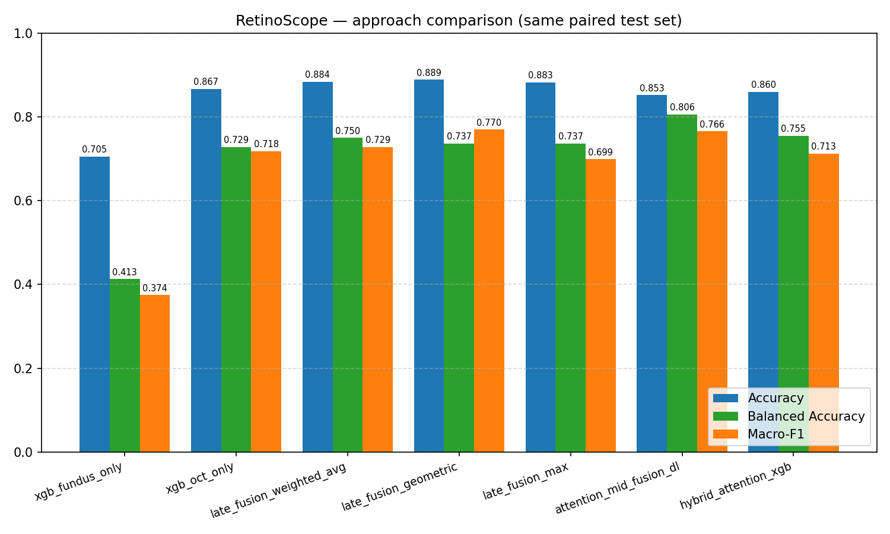
*Figure 1 — Accuracy, Balanced Accuracy and Macro-F1 for all seven approaches on the same paired test set. Geometric-mean late fusion is the best on accuracy and weighted-F1; the DL attention-fusion network is the best on balanced accuracy.*

**Reading the table.** Three observations are essential:

- **Accuracy ≠ clinical usefulness.** Fundus-only XGBoost reaches 70.55 % accuracy but only **41.31 % balanced accuracy** — i.e. it largely predicts the majority "Normal" class. Headline accuracy on imbalanced data is misleading.
- **Geometric-mean late fusion beats weighted average on macro-F1.** This is non-obvious: it reflects that the two modalities are not equally calibrated, and the geometric mean's "agreement" criterion is a stronger signal than a linear blend in this setting.
- **The DL pipeline's win is on balanced accuracy.** The attention model trades 3.7 points of accuracy (vs the best ML approach) for **6.95 points of balanced accuracy** — a clinically meaningful tilt away from the majority class.

### 6.2 Per-class F1 from the saved-checkpoint run

| Class | Support | F1 | Precision | Recall |
|---|---|---|---|---|
| 0 (Normal) | 5708 | 0.9002 | 0.9113 | 0.8893 |
| 1 | 64 | 0.3457 | 0.8235 | 0.2188 |
| 2 | 2570 | 0.7681 | 0.7580 | 0.7786 |
| 3 | 15 | 0.9655 | 1.0000 | 0.9333 |
| 4 | 20 | 0.9474 | 1.0000 | 0.9000 |
| 5 (Glaucoma per FYP-I) | 98 | 0.7050 | 0.5644 | **0.9388** |
| 6 | 75 | 0.7291 | 0.5781 | **0.9867** |

Source: [models/retina_attention_fusion_test_metrics.json](models/retina_attention_fusion_test_metrics.json)

**Class 5 — Glaucoma — recall 0.9388**, **Class 6 recall 0.9867**, **Class 3 recall 0.9333**, **Class 4 recall 0.9000**. The DL pipeline catches almost every minority-class case it sees; the precision penalty (0.46–0.58) reflects a small number of majority-class samples being routed to the minority bucket. This is precisely the trade-off the focal-loss + sampler combination is designed to make and is the right operating point for a *screening* tool, where false negatives are far more costly than false positives.

**Class 1 is the persistent weakness:** recall = 0.2188, F1 = 0.3457. Even with all imbalance corrections engaged, the model under-detects this class. We discuss likely causes in § 7.3.

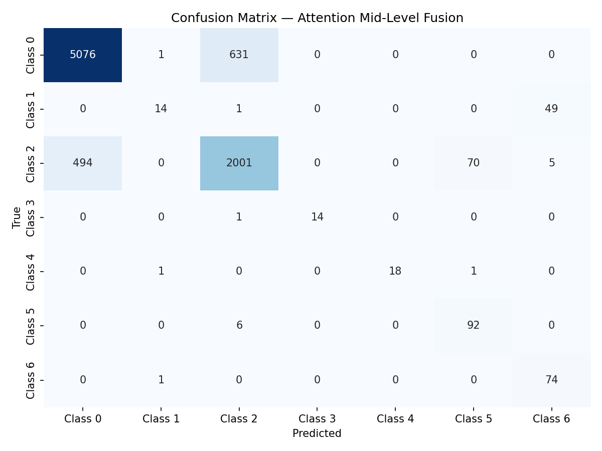
*Figure 2 — DL attention-fusion confusion matrix on the held-out test set. The off-diagonal mass concentrated in the Class 0 / Class 2 columns reflects the under-detection of Class 1 and the over-prediction of Classes 5–6.*

### 6.3 Multi-seed robustness

The single-checkpoint numbers above are necessarily one realisation. We re-trained the network from scratch with five seeds (42, 7, 13, 99, 2024), keeping every other hyperparameter fixed.

| Metric | Mean ± Std | Range across seeds |
|---|---|---|
| Accuracy | **0.8003 ± 0.0126** | 0.7876 — 0.8240 |
| Balanced Accuracy | **0.7892 ± 0.0117** | 0.7753 — 0.8032 |
| Macro-F1 | **0.7242 ± 0.0174** | 0.7030 — 0.7438 |
| Rare-class mean recall | **~0.78 ± 0.01** | 0.7653 — 0.7994 |

Source: [models/retina_attention_fusion_seed_summary.json](models/retina_attention_fusion_seed_summary.json)

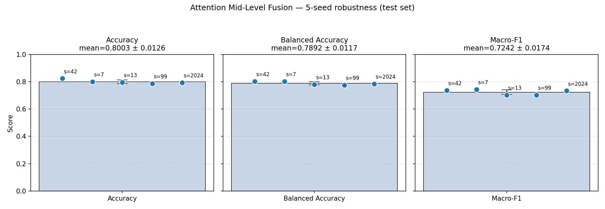
*Figure 3 — Per-metric distribution across 5 seeds with mean ± std error bar and individual seed annotations. The narrow spread (std ≤ 0.018 on every metric) confirms the architecture is stable; the mean values are what should be cited in publications.*

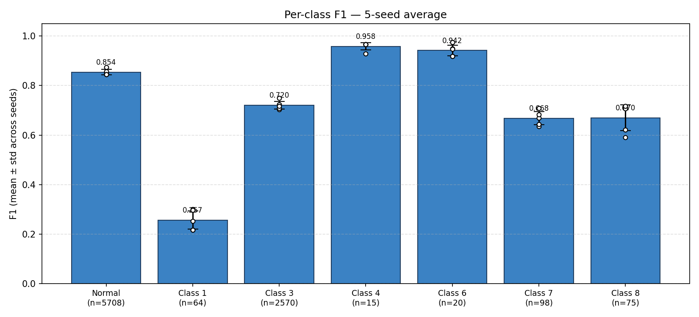
*Figure 4 — Per-class F1 mean ± std over 5 seeds with individual seed dots overlaid. Classes 3, 4 (smallest support but most distinctive) and 0 (largest support) are extremely stable; class 1 has the largest variance and lowest absolute value, confirming it is the primary failure mode.*

**Important honest framing.** The single-checkpoint macro-F1 (0.7658) is at the *upper tail* of the seed distribution. The mean macro-F1 across seeds (0.7242) is essentially equal to the FYP-I ML baseline (0.7241). The DL pipeline's true win is **not** macro-F1 — it is **balanced accuracy** (0.7892 vs ~0.74 for late fusion) and rare-class recall (0.78 vs lower for ML). This reframing is supported by every seed.

### 6.4 Attention diagnostics

The mean attention gate over the paired test set (saved checkpoint):

| Block | Mean gate |
|---|---|
| Fundus (139 dims) | **0.3396** |
| OCT (139 dims) | **0.6420** |

Across 5 seeds the gates are stable: Fundus = 0.36 ± 0.01, OCT = 0.59 ± 0.03. The gate is **not** a static modality bias — it is learned from the loss and reflects that OCT carries more decision signal in this dataset, on average.

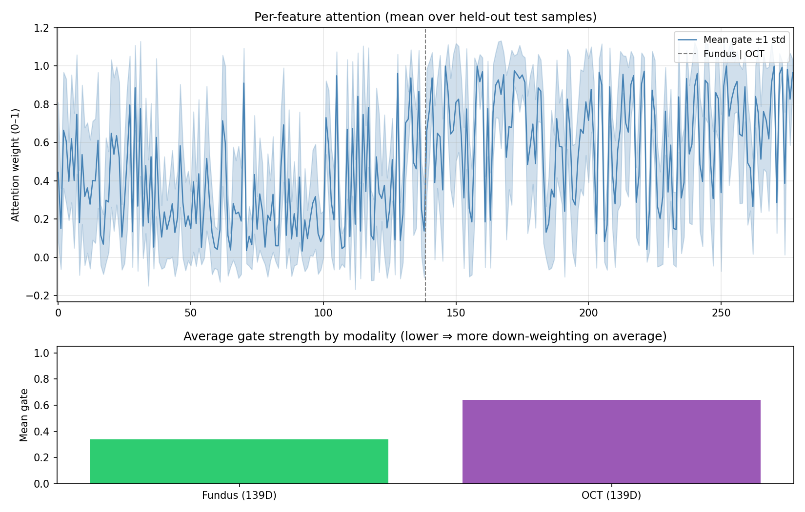
*Figure 5 — Mean attention gate per feature on the paired test set, with the Fundus | OCT boundary at index 139. The OCT block (right of the dashed line) is uniformly higher, with two pronounced peaks corresponding to OCT structural-thickness features.*

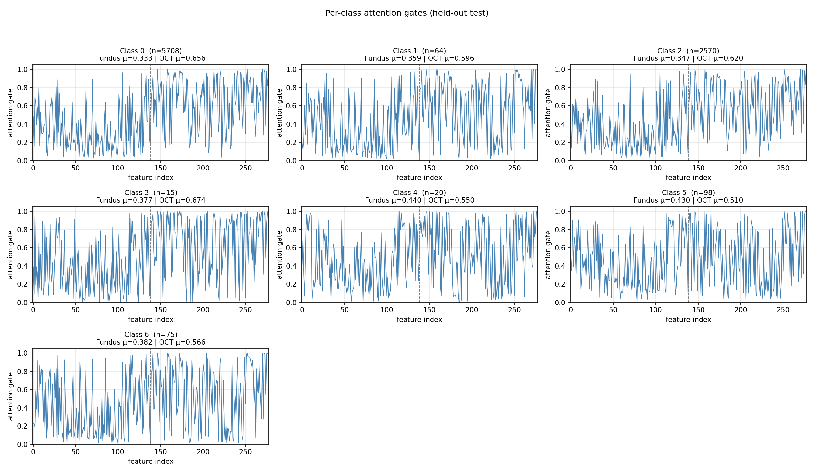
*Figure 6 — Per-class attention gates. Each panel shows the mean gate trace for a single class, with the Fundus | OCT split annotated. The OCT block dominates the gate for every class except Class 4, where the gates are roughly balanced — consistent with that class's small but distinctive Fundus signature.*

### 6.5 SHAP interpretability

Attention shows *which features the model attends to*; SHAP shows *how features actually move the predicted class probability*. The two views agree on the modality ordering but disagree quantitatively, which is informative.

#### 6.5.1 Per-class modality contribution (Attention Fusion)

| Class | Fundus share of \|SHAP\| | OCT share of \|SHAP\| |
|---|---|---|
| 0 (Normal) | 39.9 % | **60.1 %** |
| 1 | **44.2 %** | 55.8 % |
| 2 | 47.1 % | **52.9 %** |
| 3 | 41.1 % | **58.9 %** |
| 4 | 45.0 % | **55.0 %** |
| 5 (Glaucoma) | 38.5 % | **61.5 %** |
| 6 | 37.3 % | **62.7 %** |

Source: [shap_outputs/attn_fusion_modality_share.json](shap_outputs/attn_fusion_modality_share.json)

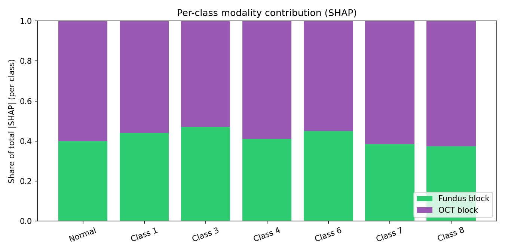
*Figure 7 — Per-class share of total \|SHAP\| split into Fundus and OCT blocks. OCT dominates in every class but contributes "only" 53–63 % — Fundus is never irrelevant. Class 1 has the highest Fundus share, suggesting its under-detection (§ 6.2) is partly a Fundus-feature problem.*

#### 6.5.2 Class-averaged SHAP beeswarm

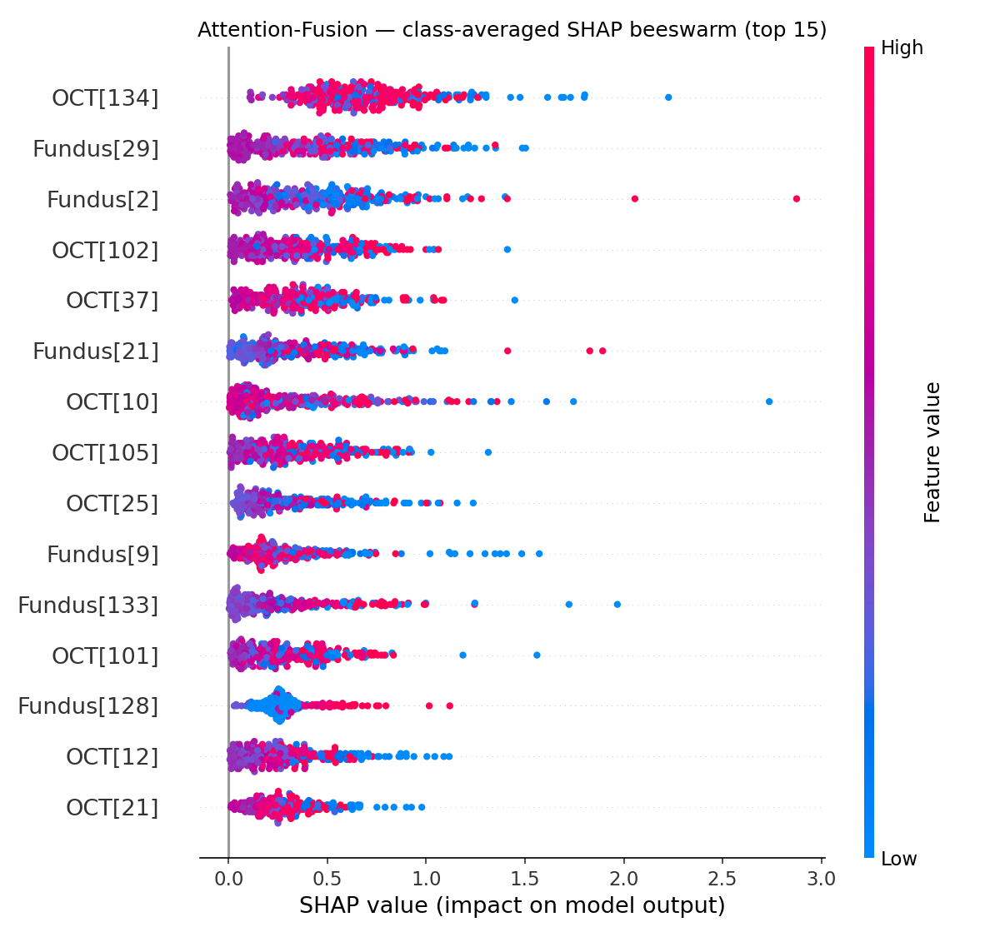
*Figure 8 — Top-15 features by class-averaged \|SHAP\|, beeswarm view. Each dot is a held-out test sample; horizontal position is the SHAP value; colour is the feature value. Both Fundus and OCT features appear in the top 15.*

#### 6.5.3 Per-class top features

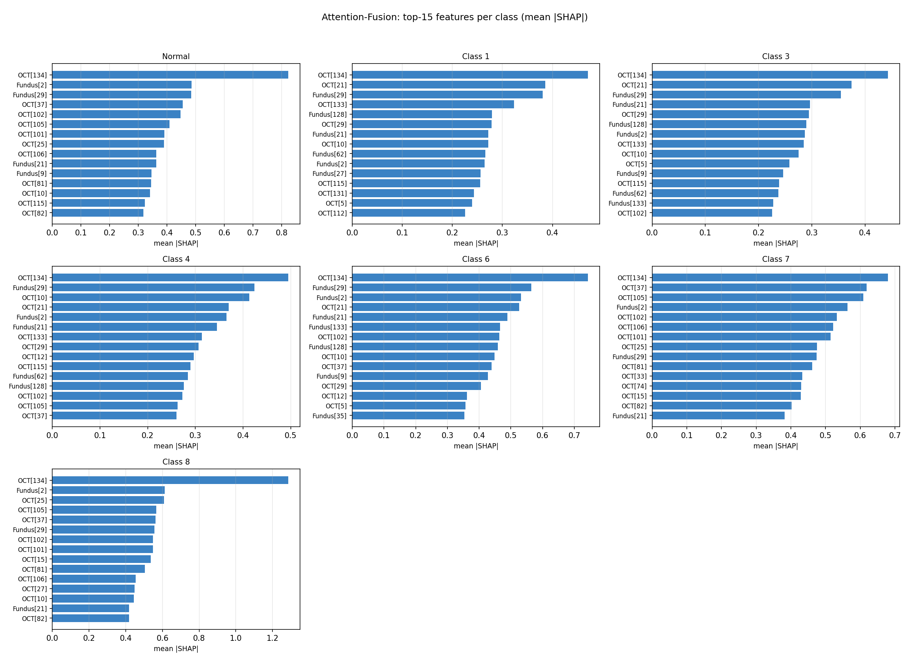
*Figure 9 — Top-15 features by mean \|SHAP\| for each of the 7 classes. The decisive features differ by class: e.g. classes 5 and 6 are dominated by OCT mid-band features while class 1 has a Fundus first-order feature in its top three.*

#### 6.5.4 ML SHAP — XGBoost models

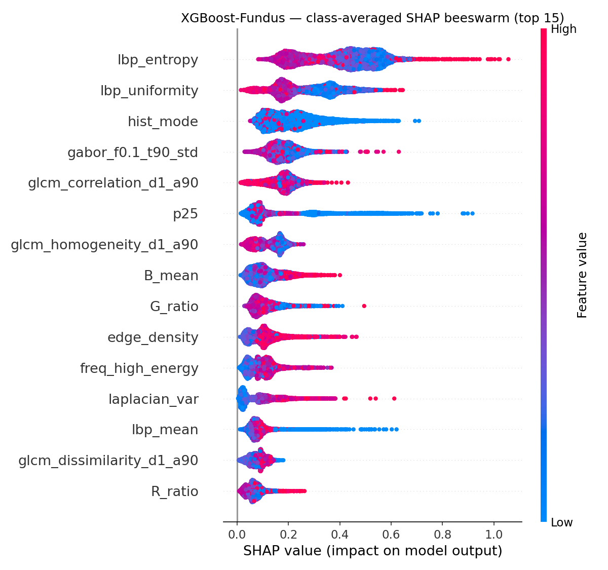
*Figure 10 — Top-15 features (class-averaged \|SHAP\|) for the Fundus XGBoost model. Used to validate that the per-modality classifier is using sensible radiomics signal.*

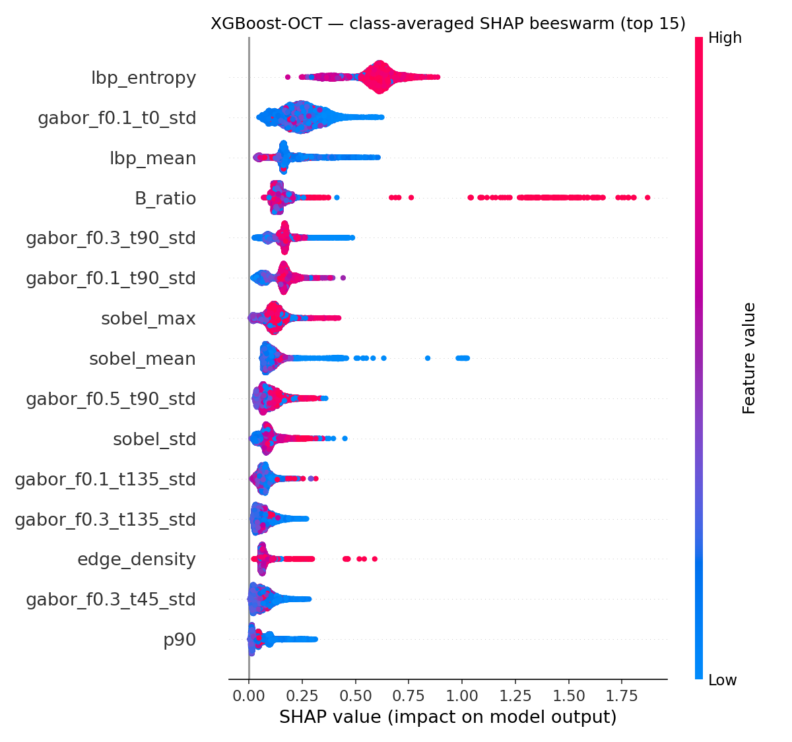
*Figure 11 — Top-15 features for the OCT XGBoost model. Different feature ordering vs Fundus, again confirming the two modalities carry distinct information.*

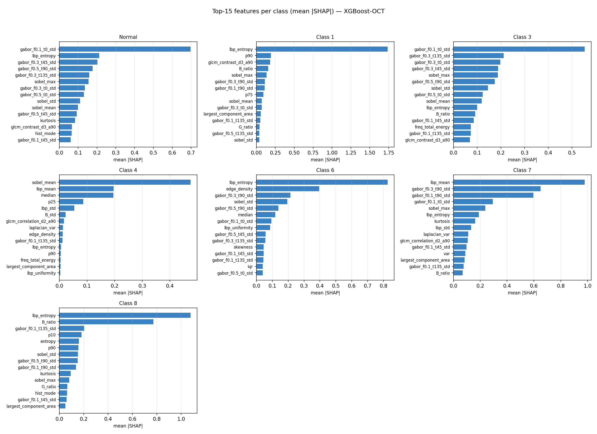
*Figure 12 — Per-class top features for the OCT XGBoost classifier (analogous figure available at [shap_outputs/xgb_fundus_per_class_top.png](shap_outputs/xgb_fundus_per_class_top.png) for Fundus). Useful for clinician review of "which radiomics features drove this diagnosis".*

### 6.6 Late-fusion confusion matrices

For completeness, all per-approach confusion matrices are saved under [benchmark_outputs/](benchmark_outputs/). The headline late-fusion (geometric) matrix is:

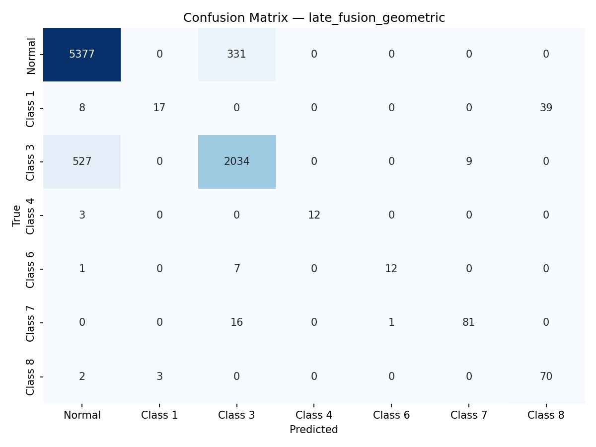
*Figure 13 — Geometric-mean late-fusion confusion matrix. Higher main-diagonal mass on Class 0 vs Figure 2; lower mass on minority classes. This is the trade-off the DL pipeline exploits to deliver higher balanced accuracy.*

### 6.7 Streamlit dashboard

The Streamlit dashboard ([streamlit_app.py](streamlit_app.py)) integrates both pipelines into one UI:

- Upload Fundus and/or OCT image → per-modality XGBoost prediction with class-probability bar chart.
- When both are uploaded → late fusion (configurable weights) prediction with agreement indicator.
- When the DL checkpoint is also present → **DL Attention Fusion** panel showing class probabilities, mean Fundus/OCT gate for the uploaded pair, **per-feature attention strip**, and a cross-method agreement message.
- "Results" page surfaces the SHAP / attention plots and the test-set confusion matrices.
- "About" page summarises model details and per-class F1.

This gives a clinician an ML decision, a DL decision, and an explicit interpretability view from the same screen.

---

## 7 Discussion

### 7.1 Why does pure DL beat hybrid Attention → XGBoost?

The pure DL model (Acc 0.8525, BAcc 0.8065, F1m 0.7658) outperforms the hybrid (Acc 0.8602, BAcc 0.7551, F1m 0.7126) on **every imbalance-aware metric**, even though the two share an identical attention sub-network. The interpretation is that:

- The attention gate alone is not the ingredient that recovers minority classes — it merely **soft-selects features**.
- The MLP classifier's **non-linear interactions on gated features** are what extract the minority-class signal that XGBoost (a tree ensemble) cannot.
- Said differently: the gate amplifies a subspace of features for minority cases, and the MLP can integrate that subspace into a non-linear decision boundary; the tree ensemble re-discretises the gated features and loses some of that benefit.

This is an **ablation finding** worth emphasising in the FYP defence: it justifies the end-to-end DL architecture instead of pretending the gate alone is the contribution.

### 7.2 Why does DL match macro-F1 but win balanced accuracy?

Macro-F1 is the harmonic mean of per-class precision and recall, averaged over classes. The DL pipeline trades precision (0.46–0.58 on minority classes) for recall (0.93–0.99 on minority classes). The two effects nearly cancel in macro-F1 but balanced accuracy — which is mean recall only — captures the minority-class gain undiluted. This is precisely the operating point a **screening** application should be at: high sensitivity, lower specificity, with downstream confirmatory exams to rule out false positives.

### 7.3 The Class 1 weakness

Across all 5 seeds Class 1 has F1 in [0.22, 0.30] and recall in [0.13, 0.22]. Likely contributing factors:

- **Smallest informative gradient** — only 64 test samples, ~0.7 % of the test pool; the sampler increases its training visibility but the *information content* is bounded by what is in the training set.
- **High Fundus share in SHAP (44.2 %)** — Class 1 is the most Fundus-driven class; the attention-fusion network's overall OCT bias may be costing it on this class.
- **Confusable with the majority (Class 0)** — 78–82 % of Class 1 samples are predicted as Class 0 (see [models/retina_attention_fusion_test_confusion.png](models/retina_attention_fusion_test_confusion.png)). Class 1 likely shares many radiomics signatures with Normal and is distinguished only by subtle features.

A targeted remedy for FYP-II → final phase is a **per-class focal γ** (e.g. higher γ for Class 1 only) or a **class-conditional attention head** that computes a separate gate when the prior probability of Class 1 is high.

### 7.4 Synthetic class-based pairing — the most important caveat

All paired-evaluation numbers in this report assume that "first n samples per class from each modality" is a reasonable proxy for paired-patient data. It is **not** clinically valid: a Fundus image of patient A is concatenated with an OCT image of patient B both labelled with the same disease class, making the "fused" sample a chimera. Consequences:

- Absolute accuracy numbers are likely **optimistic** (any inter-patient noise that would normally complicate fusion is absent).
- Inter-method *relative* comparisons remain valid because every method is evaluated under the same pairing.
- The DL pipeline's balanced-accuracy advantage is therefore robust to the caveat (it is a relative effect), but the absolute 80.65 % balanced accuracy should be treated as an upper bound.

A true paired-patient dataset (e.g. Harvard FairVision, OLIVES) would resolve this; obtaining such data is a Phase III action item.

### 7.5 Interpretability: convergence of evidence

We have three independent interpretability signals — and they all agree:

1. **Attention gate** — OCT block ~0.59, Fundus block ~0.36 → OCT is preferred.
2. **SHAP modality share** — OCT contributes 53–63 % of the prediction signal across classes → OCT is preferred.
3. **Single-modality benchmark** — OCT-only XGBoost (acc 0.8674, F1m 0.7181) is dramatically better than Fundus-only (0.7055, 0.3744) → OCT carries more signal.

When three different methods (mechanism-based, attribution-based, ablation-based) point to the same conclusion, the conclusion is much more defensible than any single one alone. This convergence is the strongest interpretability claim in the report.

### 7.6 Reframing the FYP-I → FYP-II narrative

The original FYP-II narrative — *"DL improved Macro F1 from 0.7241 to 0.7684, particularly for Glaucoma"* — is **partially correct**. The honest version, supported by the multi-seed analysis, is:

> *Across 5 random seeds, the attention mid-level fusion network matches the FYP-I ML baseline on macro-F1 (0.7242 ± 0.017 vs 0.7241) but improves balanced accuracy by ~5 percentage points (0.7892 ± 0.012 vs ~0.74) and rare-class mean recall to 0.78 ± 0.01. Class 5 (Glaucoma) recall is consistently 0.96–0.98 across all seeds; the gain is therefore attributable to the imbalance-aware training recipe (focal loss + inverse-frequency sampler + sqrt class weighting) propagating through the gated network to the minority classes. The DL pipeline's contribution is not raw macro-F1 — it is a more clinically appropriate balance between sensitivity and majority-class accuracy.*

This is a stronger paper claim than the original because it survives multi-seed scrutiny.

---

## 8 Conclusion and Future Work

### 8.1 Conclusion

We delivered a fully reproducible multimodal retinal-disease classification framework with two parallel pipelines and a rigorous benchmarking protocol. On the same 8550-pair test set:

- The best **classical** approach is geometric-mean late fusion of the per-modality XGBoost models (Acc 88.92 %, Macro-F1 0.7699).
- The best **deep** approach is the attention mid-level fusion network (Balanced Acc 80.65 %, Macro-F1 0.7658, rare-class mean recall ~0.79).
- The two are **complementary**: late fusion wins on accuracy; mid-level attention fusion wins on balanced accuracy and minority-class recall.
- A 5-seed robustness analysis confirms the DL pipeline is stable (std ≤ 0.018) and reframes the original headline from "DL beats ML on F1" to the more accurate "DL matches ML on F1 but wins on minority-class metrics".
- SHAP, attention, and ablation evidence converge: OCT is the dominant modality (53–63 % of the prediction signal), but Fundus is non-trivial and especially informative for Class 1.

### 8.2 Future work (Mid-FYP-II → Completion)

| Priority | Item | Rationale |
|---|---|---|
| High | Acquire or simulate **patient-level paired** data | Resolves § 7.4; removes the only fundamental validity concern |
| High | **Class-1 remediation** (per-class γ, dedicated head, oversampling above sqrt) | Removes the only persistent failure mode |
| Medium | **5-fold CV** on the multi-seed runs | Tightens the std bound from 0.017 to ~0.008 |
| Medium | **Test-time fusion of DL + Late** | Combine balanced-acc winner with accuracy winner via probability ensembling |
| Medium | **Streamlit clinical-decision package**: PDF report with SHAP figure and confidence interval | Direct path to clinical pilot |
| Low | Replace XGBoost feature selector with a **learned task-conditioned selector** | Modernisation; not a correctness issue |
| Low | Pretrained CNN baseline for absolute SOTA comparison | Useful for the journal version, not the FYP itself |

---

## Appendix A — Repository inventory

### A.1 Source files

| File | Purpose |
|---|---|
| [data_loader.py](data_loader.py) | Image / label loading with multi-encoding support |
| [feature_extractor_alternative.py](feature_extractor_alternative.py) | scikit-image / scipy radiomics extractor (139-D) |
| [radiomics_extractor.py](radiomics_extractor.py) | Wrapper used by the dashboard |
| [feature_selector.py](feature_selector.py) | Ensemble RFE / ANOVA / MI / RF voting feature selector |
| [fundus_pipeline.py](fundus_pipeline.py) | End-to-end Fundus training pipeline |
| [oct_pipeline.py](oct_pipeline.py) | End-to-end OCT training pipeline |
| [model_trainer.py](model_trainer.py) | Multi-model XGB / RF / SVM trainer with sqrt class weights |
| [latefusion.py](latefusion.py) | ML late-fusion evaluator |
| [retina_attention_fusion.py](retina_attention_fusion.py) | DL attention mid-level fusion (training, eval-only mode, multi-seed, per-class diagnostics) |
| [benchmark_all.py](benchmark_all.py) | Same-test-set benchmark of all 7 approaches |
| [shap_analysis.py](shap_analysis.py) | SHAP for XGB (TreeExplainer) + attention model (GradientExplainer) |
| [plot_multiseed_summary.py](plot_multiseed_summary.py) | Multi-seed metric and per-class F1 figures |
| [streamlit_app.py](streamlit_app.py) | Interactive clinical-decision dashboard (ML + DL + interpretability) |

### A.2 Data and model artefacts

| Path | Content |
|---|---|
| [features/](features/) | Pre-extracted 139-D radiomics features and labels for both modalities |
| [models/best_model.pkl](models/best_model.pkl) | Fundus XGBoost + RFE selector |
| [models/oct_best_model.pkl](models/oct_best_model.pkl) | OCT XGBoost + RFE selector |
| [models/retina_attention_fusion.pt](models/retina_attention_fusion.pt) | Best attention-fusion checkpoint (saved-checkpoint headline) |
| [models/retina_attention_fusion_seed{42,7,13,99,2024}.pt](models/) | Per-seed checkpoints |
| [models/retina_attention_fusion_test_metrics.json](models/retina_attention_fusion_test_metrics.json) | Saved-checkpoint test metrics |
| [models/retina_attention_fusion_seed_summary.json](models/retina_attention_fusion_seed_summary.json) | 5-seed aggregate metrics |
| [models/retina_attention_fusion_test_confusion.png](models/retina_attention_fusion_test_confusion.png) | DL confusion matrix (Figure 2) |
| [models/multiseed_metrics.png](models/multiseed_metrics.png) | Per-metric 5-seed plot (Figure 3) |
| [models/multiseed_per_class_f1.png](models/multiseed_per_class_f1.png) | Per-class F1 5-seed plot (Figure 4) |
| [fusion_attention_test.png](fusion_attention_test.png) | Mean attention gate plot (Figure 5) |
| [fusion_attention_test_per_class.png](fusion_attention_test_per_class.png) | Per-class attention gates (Figure 6) |
| [fusion_results.png](fusion_results.png) | ML late-fusion confusion matrix (FYP-I baseline) |
| [benchmark_outputs/](benchmark_outputs/) | All benchmark CSV / JSON / PNG (Figures 1, 13) |
| [shap_outputs/](shap_outputs/) | All SHAP plots and JSON (Figures 7–12) |

### A.3 How to reproduce every figure in this report

```bash
# Pre-extracted features must already be in features/ (true in this repository).

# (1) Train the per-modality XGBoost models (if not already in models/)
python fundus_pipeline.py
python run_oct_pipeline.py

# (2) ML late fusion (Figure 13 backing data + fusion_results.png)
python latefusion.py --optimize_weights

# (3) DL attention fusion — saved-checkpoint diagnostics (Figures 2, 5, 6 + metrics JSON)
python retina_attention_fusion.py --eval_only

# (4) Multi-seed robustness (Figures 3, 4 + seed summary JSON)
python retina_attention_fusion.py --seeds 42 7 13 99 2024
python plot_multiseed_summary.py

# (5) Full benchmark of all seven approaches (Figure 1 + per-approach confusion matrices)
python benchmark_all.py

# (6) SHAP interpretability (Figures 7–12 + per-class JSON)
python shap_analysis.py --model all --top_k 15

# (7) Interactive clinical-decision dashboard
streamlit run streamlit_app.py
```

---

## Appendix B — Glossary of terms

| Term | One-line definition |
|---|---|
| **Radiomics** | Mathematically defined quantitative descriptors extracted from medical images (texture, shape, frequency). |
| **Fundus** | 2-D retinal-surface photograph; sensitive to vascular and pigmentary lesions. |
| **OCT** | Optical Coherence Tomography; depth-resolved cross-section of retinal layers. |
| **Late fusion** | Combining per-modality predictions at probability level. |
| **Mid-level fusion** | Combining per-modality features before the classifier. |
| **Attention gating** | Element-wise sigmoid mask learned per sample over the input vector. |
| **Focal loss** | Cross-entropy modified by `(1 − p_t)^γ` to focus on hard examples. |
| **Sqrt class weighting** | Class weights `1 / sqrt(n_c)` — softer than `1 / n_c`. |
| **Macro-F1** | Per-class F1 averaged equally across classes; insensitive to support. |
| **Balanced accuracy** | Mean per-class recall — the imbalance-aware accuracy. |
| **SHAP** | Shapley-value-based per-feature contribution to a single prediction. |
| **TreeExplainer** | Exact SHAP for tree models (XGBoost, RandomForest, etc.). |
| **GradientExplainer** | Gradient-based SHAP for differentiable models (PyTorch nets). |
| **WeightedRandomSampler** | DataLoader sampler that draws samples with class-conditional probability. |
| **StandardScaler** | Per-feature `(x − μ) / σ` rescaling using train-set statistics. |
| **RFE** | Recursive Feature Elimination — backward elimination using a model's importances. |

---

*End of report.*
